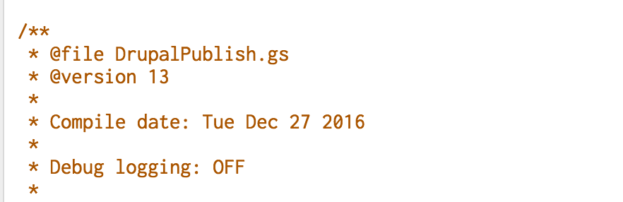
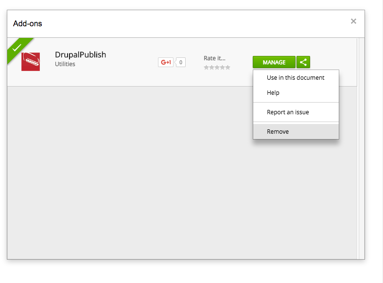
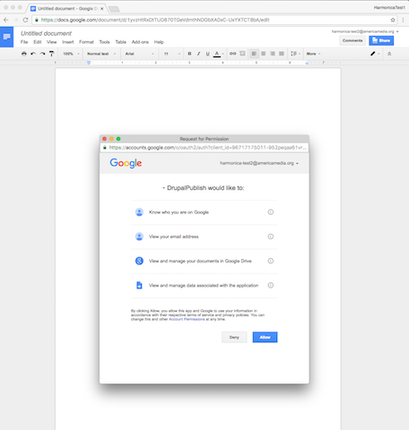
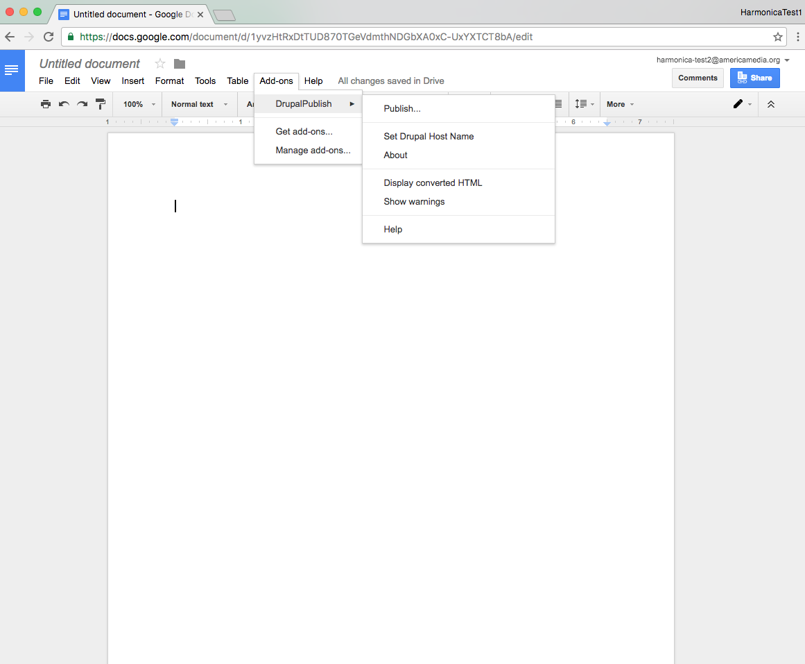

title: GDocs Publish
subtitle: Drupal Module and Google Docs Add-On
date: 31 January 2017
version: 1.0
author: Ken Ficara
harmonica: yes
headers: yes
geometry: margin=1in
logo: yes
coverpage: yes
toc: yes

## Introduction

GDocs Publish enables Drupal users to create and edit documents in Google Documents, and then publish them directly to Drupal. It consists of a Drupal module, and a [Google Docs add-on](https://chrome.google.com/webstore/detail/drupalpublish/hgmlneddbkcoopmibclacpfkobaepobj).

## Version history

- **1.0**: 11 January 2017
:	Initial release

- **1.1**: 31 January 2017
:	Added filtering and pagination to list of published nodes
:	Fixed bug causing UID to be left unset

## Drupal installation

Simply install and enable the `gdocs_publish` Drupal module. The [Drupal 8 Entity API module](https://www.drupal.org/project/entity) is also required (while the basic entity API is part of the Drupal 8 core, our module requires some functionality that has not yet been ported).

At present there is no configuration. However, the module does provide two permissions:

- **Publish From Google** is required for a Drupal user to create content from Google Documents. Users without this permission who attempt to use the Google Docs **Publish to Drupal** command will receive an error message.
- **Administer GDocs Publish** will be required for configuration of the module. It is not yet used.

**Important Note:** Uninstalling this module will delete the module's database table tracking nodes created from Google Documents. That data cannot be recovered once deleted. This is more significant in Drupal 8, which no longer has the concept of "disabling" a module; modules are either installed or uninstalled. 

### Updating from 1.0

A database update is required for version 1.1, to add and populate a `content_type` column to the `gdocs_publish` table in order to allow filtering by content type. The update also updates nodes with null `uid` values created by version 1.0, setting the owner to a default value, and similarly fixes the `uid` column in the module's own table. 

\newpage 

## Add-On Deployment

Before you start, make sure you know what version you're working with. The Chrome web store displays an incorrect version number in some places. The correct version number is indicated below with green arrows; the incorrect one with red:

\newpage

### Version in Script Editor

The correct version number will match the version shown under `File -> Manage Versions` in the script editor:

\newpage

### Version in Code

The same version should also be reflected in the code itself:

(If it is incorrect, open an issue. Do not change the code in the script editor.)

\newpage

### Remove any old versions

If the add-on is already installed, remove it by going to `Add-ons -> Manage Add-ons` and clicking the green **Manage** button, then choosing **Remove**.

\newpage

### Ensure old versions are removed

Check under add-ons to make sure it's removed.

\newpage

### Find the add-on

Choose **Get Add-ons** and then **For americamedia.org** from top-left dropdown:

\newpage

### Install the add-on and grant permissions

If the add-on shows version 13, install it and grant it permissions:

\newpage

### Check the version

Post-installation help text displays.

\newpage

### Check installation

The Drupal Publish submenu is properly populated:

\newpage

### Try publishing

Choose "Publish..." and the dialog appears, with Drupal host already set:

\newpage

## Troubleshooting

If publishing to Drupal causes problems, please follow the steps below:

* If you don't have the "Publish to Drupal" menu item under add-ons, you probably don't have the add-on installed. Please [install the add-on](https://chrome.google.com/webstore/detail/drupalpublish/hgmlneddbkcoopmibclacpfkobaepobj) here.
* If you get the error "Add-on not found" after installation, sign out of all your Google accounts (choose "Sign Out" from the menu on top right under your avatar icon), and then sign back in only to your America account. Then reinstall the add-on.
* If you get an error in Google Documents when installing or using the add-on, review your document to see if there is any unusual formatting or other items that may be causing trouble. Remove them and try again.
* If you get an error in Drupal after publishing a document, please screenshot the error and let us know what document you were publishing from.

## Drupal module

The Drupal module is documented [according to Drupal standards](https://www.drupal.org/docs/develop/coding-standards/api-documentation-and-comment-standards).

## GAS Add-On

The GAS code for the add-on is documented using [JSDoc](http://usejsdoc.org/). The code is currently included in the `gs` subdirectory of the module, in order to keep the module and the add-on in sync. (Additionally, Google provides no real version control for container-bound apps scripts, so this is the main repository for the code.)

### Directory contents

- `DrupalPublishForm.html`
  - This is the HTML for the **Publish to Drupal** dialog
- `DrupalPublish.js`
	- This is the source code from which the add on is created. This is *not* the apps script code itself.
- `Tags.js`
  - The stack class used for the HTML processing
- `DrupalPublish.gs`
  - The add-on code. 
- `ConvertGoogleDocToCleanHtml.js`
  - Original code maintained for reference but no longer used. (See below)

### Creating a release

The GAS code is managed using [`preprocessor.js`](https://www.npmjs.com/package/preprocessor). To create the production code:

	`preprocess DrupalPublish.js . > DrupalPublish.gs`

To create a version with debug logging enabled:

	`preprocess DrupalPublish.js . -DEBUG=true > DrupalPublish.gs`

### HTML Conversion

Converting a Google Doc to HTML should have been simple -- after all you can just download it as such. However, in an add-on, you can [get the document only as text](https://developers.google.com/apps-script/reference/document/text#getText%28%29) (no formatting) or as a PDF using [`Document.getAs()`](https://developers.google.com/apps-script/reference/document/document#getAs%28String%29), which returns a [`Blob`](https://developers.google.com/apps-script/reference/base/blob) which has a [`getAs` method](https://developers.google.com/apps-script/reference/base/blob#getAs%28String%29), which takes a string argument with the MIME type:

> For most blobs, 'application/pdf' is the only valid option. For images in BMP, GIF, JPEG, or PNG format, any of 'image/bmp', 'image/gif', 'image/jpeg', or 'image/png' are also valid.

There is an [open issue](https://code.google.com/p/google-apps-script-issues/issues/detail?id=585) asking for the obvious enhancement, but five years later nothing has changed. However the issue does have some workarounds. The best seems to be to use the document ID to get the file, but the [Drive Service](https://developers.google.com/apps-script/reference/drive/) API has the same limitations.

The only way to get the HTML version of the document is to peform a URL fetch to the export link, but then you find that the converted HTML is awful, almost worse than what most word processors produce. There is no structural markup whatsoever; even bold text is turned into a `` with some arbitrary class name.

Therefore we turned to [GoogleDoc2Html](https://github.com/oazabir/GoogleDoc2Html) to render the Google Document into HTML. However, this was also problematic as it attempts to process the document in sequence according to its default structure (where there is, for instance, no such thing as a **list** element, just **list items** that may represent new lists, nested lists, or new items for an existing list). This led to poor performance and conversion errors. The original script also attempts to process a much wider range of content (inline images, equations) than were deemed necessary for Drupal content. 

The HTML conversion was rewritten as a recursive operation that builds the HTML output in a "Tags" object, which is a basic stack implementation with contextual and backtracking methods and various HTML-specific operations (eg, handling tag attributes, distinguishing between container tags and self-closing tags, etc). The code for the Tags object is maintained separately but included inline in the final GAS code because Google [recommends against using libraries in add-ons](https://developers.google.com/apps-script/best_practices#avoidLibraries).