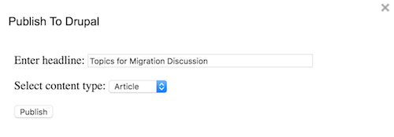

# Publishing Google Documents to Drupal

You can now publish Google Documents directly to Drupal, using the Drupal Publish add-on, available as a [Google Docs add-on](https://chrome.google.com/webstore/detail/drupalpublish/hgmlneddbkcoopmibclacpfkobaepobj).

To use it, first install the add-on. Then, under the Add-ons menu, choose `DrupalPublish -> Publish...`. This will bring up a dialog box:

The headline field will default to the title of your document; edit it if you want, but make sure not to use any HTML tags. Below that, select whether you are publishing an article or a blog post, and then click the Publish button.

## Drupal Hostname

If you get a message that you must set the Drupal host name, choose `DrupalPublish -> Set Drupal Host Name`, and in the dialog, enter `http://www.americamagazine.org/`.

## HTML testing

To test HTML conversion separately from Drupal publishing, use the **Convert to HTML** menu item. This will run the same HTML conversion routine used for Drupal publishing, but show the results in a popup window rather than publishing them. This function also activates logging to the script log.

## Drupal tracking

Every publish action is logged, and visible on the **Recent Log Messages** page (`admin/reports/dblog`). The log message includes the node ID and headline as well as
the title and ID of the Google Document, and the email of the user who published it. Filter the log messages for `gdocs_publish` to find them more easily.

------

- **Version**: 5
- **Date**: 20 December 2016
- **Author**: [Ken Ficara](ken@harmoni.ca)
