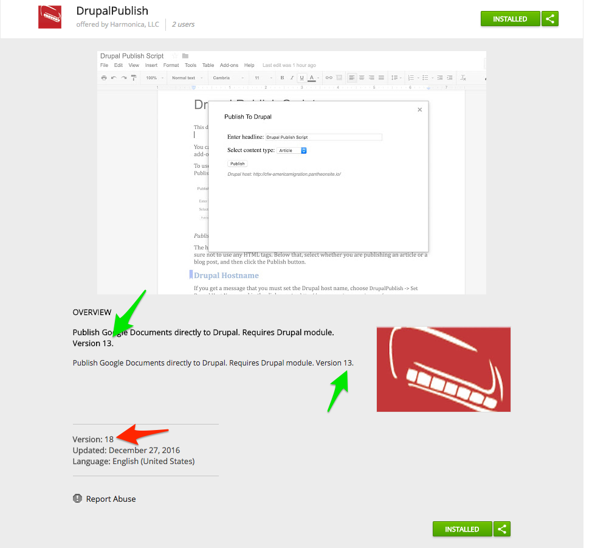
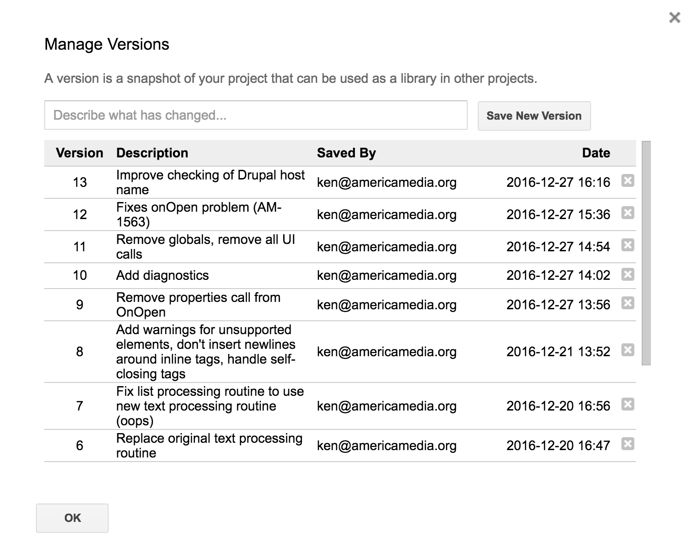
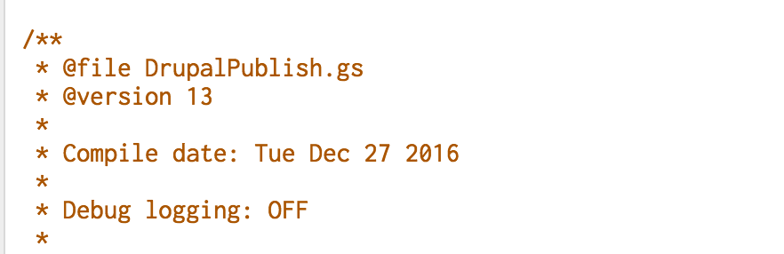
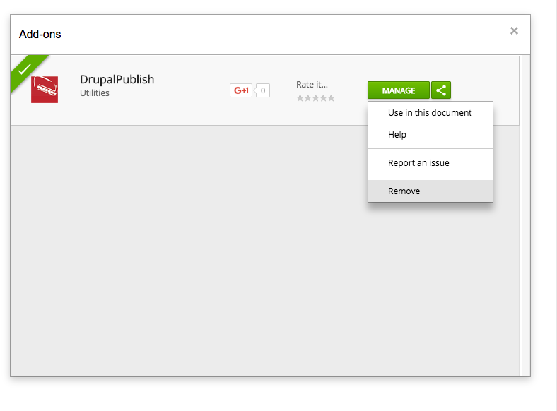
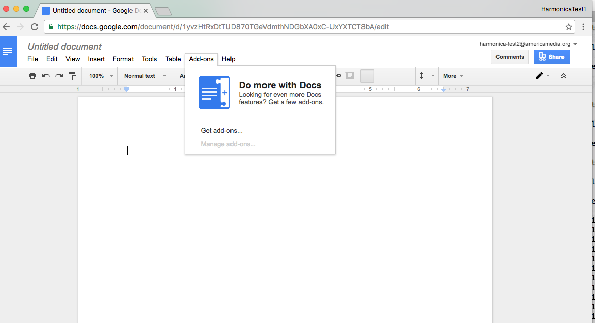
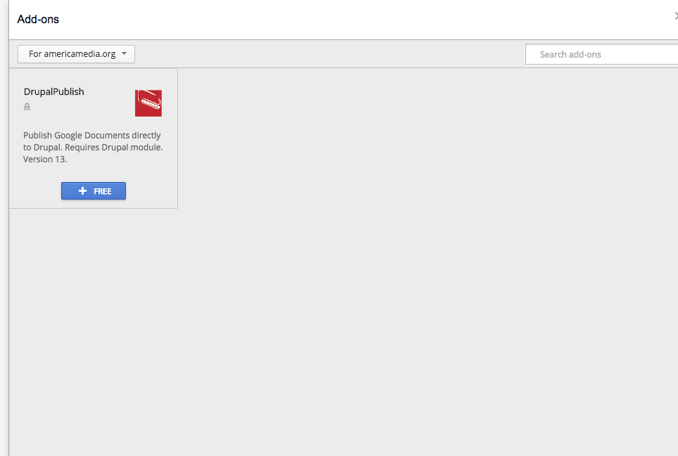
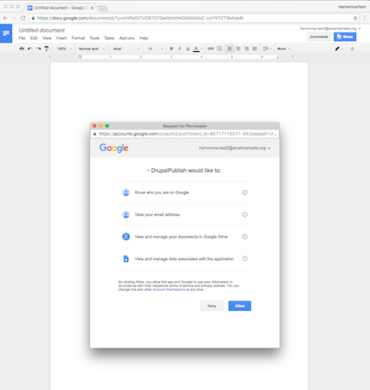
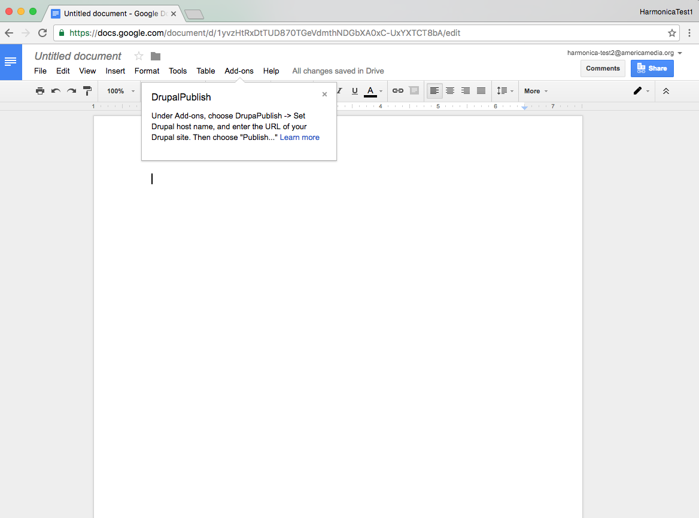
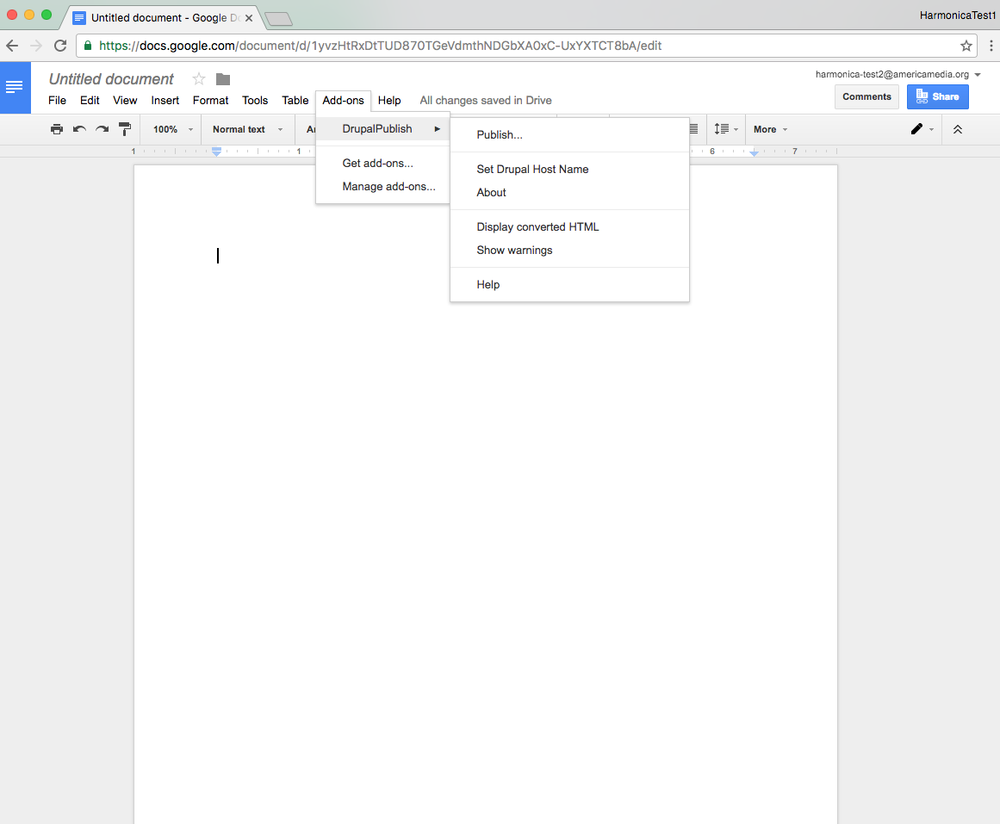
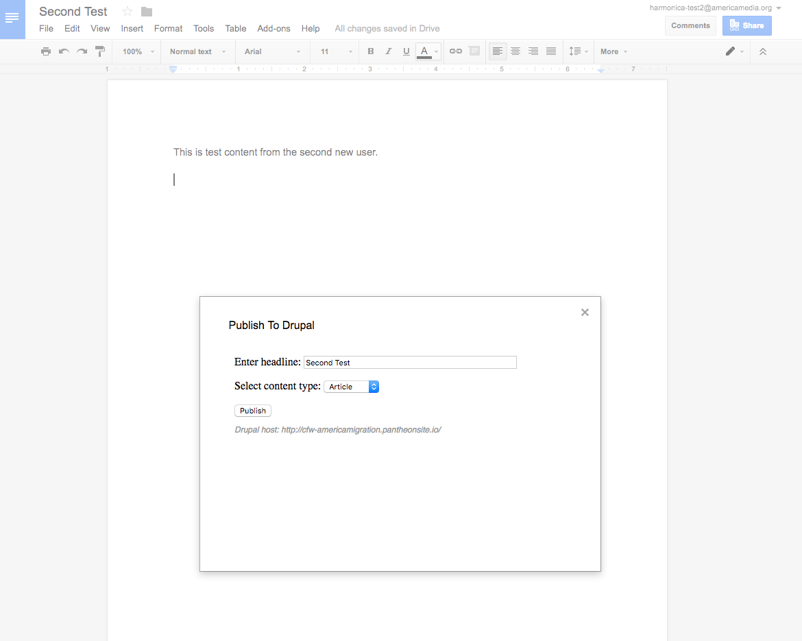

title: GDocs Publish
subtitle: Drupal Module and Google Docs Add-On
date: 31 January 2017
author: Ken Ficara
harmonica: yes
headers: yes
geometry: margin=1in
logo: yes

## Add-On Deployment

Before you start, make sure you know what version you're working with. The Chrome web store displays an incorrect version number in some places. The correct version number is indicated below with green arrows; the incorrect one with red:

\newpage

## Version in Script Editor

The correct version number will match the version shown under `File -> Manage Versions` in the script editor:

\newpage

## Version in Code 

The same version should also be reflected in the code itself:

(If it is incorrect, open an issue. Do not change the code in the script editor.)

\newpage

## Remove any old versions

If the add-on is already installed, remove it by going to `Add-ons -> Manage Add-ons` and clicking the green **Manage** button, then choosing **Remove**. 

\newpage

## Ensure old versions are removed

Check under add-ons to make sure it's removed.

\newpage

## Find the add-on

Choose **Get Add-ons** and then **For americamedia.org** from top-left dropdown:

\newpage

## Install the add-on and grant permissions

If the add-on shows version 13, install it and grant it permissions:

\newpage

## Check the version

Post-installation help text displays. 

\newpage

## Check installation

The Drupal Publish submenu is properly populated:

\newpage

## Try publishing

Choose "Publish..." and the dialog appears, with Drupal host already set:

